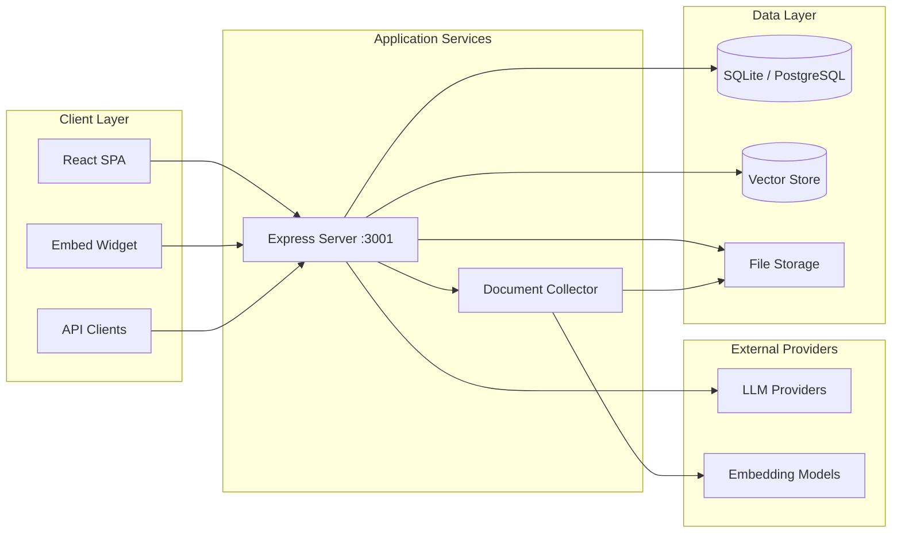

# UniversalLLM

**Private AI workspace by Abdul Ismail**

UniversalLLM is a production-ready, self-hostable platform for building private LLM workflows. Connect local or cloud models, ingest documents into vector stores, run AI agents with MCP tooling, and collaborate in multi-user workspaces — all from a single application.

**Repository:** [https://github.com/ismailubts/UniversalLLM](https://github.com/ismailubts/UniversalLLM)

---

## Table of Contents

- [Overview](#overview)
- [What UniversalLLM Provides](#what-universalllm-provides)
- [Who It's For](#who-its-for)
- [What You Get Out of the Box](#what-you-get-out-of-the-box)
- [Vision & Purpose](#vision--purpose)
- [Features](#features)
- [Architecture](#architecture)
- [Technology Stack](#technology-stack)
- [Folder Structure](#folder-structure)
- [Core Modules](#core-modules)
- [Authentication Flow](#authentication-flow)
- [Installation](#installation)
- [Environment Variables](#environment-variables)
- [Local Development](#local-development)
- [Docker Deployment](#docker-deployment)
- [Production Deployment](#production-deployment)
- [Configuration Guide](#configuration-guide)
- [Usage Examples](#usage-examples)
- [API](#api)
- [Troubleshooting](#troubleshooting)
- [Future Roadmap](#future-roadmap)
- [Repository & Support](#repository--support)
- [Copyright](#copyright)

---

## Overview

UniversalLLM combines document chat (RAG), configurable AI agents, model routing, embeddable widgets, and a developer API into one deployable stack. It runs locally by default with SQLite and supports optional vector databases, transcription providers, and dozens of LLM backends.

**Scope:** Self-hosted AI workspace for individuals and teams who need full control over data, models, and integrations.

---

## What UniversalLLM Provides

UniversalLLM is an all-in-one private AI platform. Instead of stitching together separate tools for chat, documents, agents, and APIs, you deploy one stack that covers the full workflow.

| Capability | What you can do |
|------------|-----------------|
| **Document intelligence** | Upload PDFs, DOCX, TXT, and web pages; chunk and embed content; chat with your documents using retrieval-augmented generation (RAG) with source citations |
| **AI agents** | Build agents in a no-code UI; enable tool use, MCP servers, scheduled jobs, web browsing, and file creation |
| **Model flexibility** | Run locally with Ollama or LM Studio, or connect cloud providers (OpenAI, Anthropic, Gemini, Azure, and many more) |
| **Vector storage** | LanceDB by default; optional Chroma, Pinecone, PGVector, Milvus, Weaviate, and others |
| **Team-ready** | Multi-user role-based access, workspaces, and admin controls (Docker deployments) |
| **Embeds & integrations** | Drop-in website chat widget, OpenAPI REST API (`/api/v1`), browser extension hooks |
| **Privacy-first** | Self-hosted by default; optional anonymous telemetry; your data stays on your infrastructure |

---

## Who It's For

- **Individuals** who want a private ChatGPT-style workspace over their own files
- **Developers** who need an API-first LLM backend with document RAG and agent tooling
- **Teams** that require on-premises or VPC deployment with workspace isolation and RBAC
- **Organizations** that must avoid vendor lock-in and keep documents, chats, and embeddings under their control

---

## What You Get Out of the Box

- A **React web app** for chat, onboarding, admin, and settings
- An **Express API server** with JWT auth, WebSockets, and OpenAPI docs
- A **document collector** service for parsing and preparing files for embedding
- **SQLite** (default) or PostgreSQL for application data
- **LanceDB** (default) or another vector DB for semantic search
- **Docker** images and cloud deployment templates (Kubernetes, Helm, AWS, GCP, DigitalOcean)
- **Embeddable chat widget** for websites
- **Multi-language UI** (i18n)

---

## Vision & Purpose

**Vision:** Make private, capable AI infrastructure accessible without vendor lock-in.

**Purpose:** Provide an integrated environment where users can:

- Chat with their own documents using retrieval-augmented generation
- Automate workflows with agents, skills, and scheduled jobs
- Operate entirely on-premises or in their own cloud account
- Extend the platform via API, MCP servers, and embed widgets

---

## Features

- **Multi-provider LLM support** — OpenAI, Anthropic, Ollama, Gemini, Azure, and many more
- **Document ingestion** — PDF, DOCX, TXT, web links, and more via the collector service
- **Vector databases** — LanceDB (default), Chroma, Pinecone, PGVector, Milvus, Weaviate, and others
- **AI agents & agent flows** — No-code agent builder, web browsing, file creation, MCP compatibility
- **Model routing** — Route conversations to optimal models based on rules
- **Multi-user & RBAC** — Role-based access with workspace permissions (Docker deployment)
- **Embeddable chat widget** — Drop-in website chat powered by workspace embed configs
- **Developer API** — OpenAPI-documented REST API for integrations
- **Mobile & extension hooks** — Browser extension API keys, mobile connection support
- **Internationalization** — UI available in multiple languages

---

## Architecture



### Request flow (chat with documents)

1. User uploads a document in the frontend.
2. Frontend sends the file to the **collector**, which parses, chunks, and embeds content.
3. Embeddings are stored in the configured **vector database**; metadata is persisted in **SQLite**.
4. On chat, the **server** retrieves relevant chunks, builds context, and streams a response from the selected **LLM provider**.

---

## Technology Stack

| Layer | Technology |
|-------|------------|
| Frontend | React 18, Vite, Tailwind CSS, i18next |
| Backend | Node.js 18+, Express, WebSockets |
| ORM / DB | Prisma, SQLite (default), PostgreSQL (optional) |
| Document processing | Puppeteer, LangChain, custom parsers |
| Agents | Aibitat agent framework, MCP SDK |
| Container | Docker multi-arch (amd64/arm64) |
| CI | GitHub Actions |

---

## Folder Structure

```
UniversalLLM/
├── frontend/           # React SPA (Vite)
├── server/             # Express API, Prisma, agents, providers
│   ├── endpoints/      # Route handlers (chat, admin, api, embed, …)
│   ├── models/         # Data access layer
│   ├── prisma/         # Schema, migrations, seed
│   ├── storage/        # SQLite DB, uploads, plugins, models
│   └── utils/          # LLM providers, vector DBs, agents, boot
├── collector/          # Document ingestion microservice
├── docker/             # Dockerfile, compose, entrypoint scripts
├── cloud-deployments/  # Helm, K8s, AWS, GCP, DigitalOcean templates
├── extras/             # Translators, support utilities
└── open-computer/      # Agent computer environment (experimental)
```

---

## Core Modules

### Frontend (`frontend/`)

| Area | Responsibility |
|------|----------------|
| `src/pages/` | Route-level views: chat, onboarding, admin, settings |
| `src/components/` | Reusable UI: sidebar, chat container, modals |
| `src/models/` | Client-side API wrappers |
| `src/locales/` | i18n translation files |
| `src/utils/constants.js` | Auth tokens, appearance keys, provider URL defaults |

**Entry:** `index.html` → `src/main.jsx` → React Router

### Backend (`server/`)

| Area | Responsibility |
|------|----------------|
| `index.js` | Express bootstrap, middleware, route mounting |
| `endpoints/` | REST + WebSocket handlers grouped by domain |
| `models/` | Prisma-backed business logic |
| `utils/AiProviders/` | LLM adapter implementations |
| `utils/vectorDbProviders/` | Vector store adapters |
| `utils/agents/` | Agent orchestration (aibitat) |
| `utils/boot/MetaGenerator.js` | SSR meta tags for production SPA |
| `swagger/` | OpenAPI specification |

**Default port:** `3001`

### Collector (`collector/`)

Standalone service that accepts documents and URLs, extracts text, chunks content, and returns processed payloads for embedding. Uses Puppeteer for web scraping where needed.

### Database layer

- **Primary:** SQLite at `server/storage/universalllm.db` (configurable via Prisma)
- **Models:** Users, workspaces, chats, documents, embed configs, agents, scheduled jobs, and more — see `server/prisma/schema.prisma`
- **Vector data:** Stored in the configured vector provider (LanceDB files under `server/storage/` by default)

---

## Authentication Flow

1. User submits username/password to `/api/request-token` (or completes onboarding).
2. Server validates credentials and returns a **JWT** signed with `JWT_SECRET`.
3. Frontend stores the token in `localStorage` under `universalllm_authToken`.
4. Subsequent requests include the token; middleware validates expiry and user role.
5. **Multi-user:** Admin/manager/default roles gate workspace and settings access.
6. **SSO / temp tokens:** Optional `ullm-tat-*` single-use tokens for `/sso/login` flows.

---

## Installation

### Prerequisites

- Node.js **18+**
- Yarn
- Git

### Quick start (bare metal)

```bash
git clone https://github.com/ismailubts/UniversalLLM.git
cd UniversalLLM
yarn setup
```

Then run each service in a separate terminal:

```bash
yarn dev:server
yarn dev:collector
yarn dev:frontend
```

Open `http://localhost:3000` and complete onboarding.

See [BARE_METAL.md](BARE_METAL.md) for detailed bare-metal instructions.

---

## Environment Variables

Copy example env files during setup (`yarn setup:envs`):

| File | Purpose |
|------|---------|
| `server/.env.development` | LLM keys, JWT, vector DB, feature flags |
| `frontend/.env` | API base URL overrides |
| `collector/.env` | Collector port and options |
| `docker/.env` | Container UID/GID, storage paths |

**Critical server variables:**

| Variable | Description |
|----------|-------------|
| `JWT_SECRET` | Secret for signing session tokens (min 12 chars) |
| `LLM_PROVIDER` | Active provider key (`openai`, `ollama`, …) |
| `VECTOR_DB` | Vector provider (`lancedb`, `chroma`, `pinecone`, …) |
| `STORAGE_DIR` | Path to persistent storage (Docker) |
| `COMMUNITY_HUB_API_BASE` | Optional community hub API URL (leave empty to disable) |

Full reference: [`server/.env.example`](server/.env.example)

---

## Local Development

```bash
# Install all workspaces + migrate DB
yarn setup

# Run all three services concurrently
yarn dev

# Lint all packages
yarn lint:ci

# Regenerate OpenAPI spec
cd server && yarn swagger
```

**Frontend only:** `cd frontend && yarn dev`  
**Server only:** `cd server && yarn dev`  
**Collector only:** `cd collector && yarn dev`

---

## Docker Deployment

```bash
cd docker
cp .env.example .env   # if not already copied
docker compose up -d --build
```

Application available at `http://localhost:3001`.

See [docker/HOW_TO_USE_DOCKER.md](docker/HOW_TO_USE_DOCKER.md) for image tags, volumes, and production notes.

**Default image name (configure for your registry):** `ismailubts/universalllm`

---

## Production Deployment

| Method | Location |
|--------|----------|
| Docker Compose | `docker/docker-compose.yml` |
| Kubernetes | `cloud-deployments/k8/manifest.yaml` |
| Helm | `cloud-deployments/helm/charts/universalllm/` |
| AWS CloudFormation | `cloud-deployments/aws/cloudformation/` |
| GCP | `cloud-deployments/gcp/deployment/` |
| DigitalOcean Terraform | `cloud-deployments/digitalocean/terraform/` |
| OpenShift | `cloud-deployments/openshift/` |

**Recommendations:**

- Set strong `JWT_SECRET`, `SIG_KEY`, and `SIG_SALT`
- Mount persistent volumes for `server/storage`
- Put reverse proxy (nginx/Caddy) with TLS in front of port 3001
- Configure backups for SQLite/PostgreSQL and vector store data

## Configuration Guide

1. **Onboarding wizard** — First launch walks through LLM, embedding, and vector DB selection.
2. **Admin → Settings** — Custom app name, logo, meta tags, telemetry toggle.
3. **Workspace settings** — Per-workspace LLM, system prompt, agent config.
4. **Agent flows** — Visual builder under Admin → Agent Flows.
5. **MCP servers** — Configure in `server/storage/plugins/universalllm_mcp_servers.json` or via UI.

---

## Usage Examples

### Chat with a PDF

1. Create or open a workspace.
2. Drag and drop a PDF into the chat or upload via workspace documents.
3. Ask questions; responses cite ingested sources.

### Embed widget on a website

1. Go to **Settings → Chat Embed Widgets** and create an embed config.
2. Copy the script snippet (loads `/embed/UniversalLLM-chat-widget.min.js`).
3. Paste before `</body>` on your site.

### Developer API

```bash
curl -H "Authorization: Bearer YOUR_API_KEY" \
  http://localhost:3001/api/v1/workspaces
```

Interactive docs: `http://localhost:3001/api/docs` (when server is running).

---

## API

- **Base path:** `/api`
- **Developer API:** `/api/v1/*` (API key auth)
- **OpenAPI:** Generated into `server/swagger/openapi.json`; served at `/api/docs`
- **WebSockets:** Agent streaming and real-time features via WebSockets (Express WS middleware)

---

## Troubleshooting

| Issue | Solution |
|-------|----------|
| Port 3001 in use | Set `SERVER_PORT` in server env |
| Database errors | Run `yarn prisma:setup` from repo root |
| Ollama unreachable from Docker | Use `http://host.docker.internal:11434` |
| Embeddings fail | Verify embedding provider keys and `EMBEDDING_ENGINE` |
| Blank page in production | Check server is serving `frontend/dist` and meta boot is running |
| Collector timeouts on URLs | Increase Puppeteer timeout; check network from container |

**Logs:** Server logs to stdout; enable `ENABLE_HTTP_LOGGER=true` in development.

---

## Future Roadmap

- Expanded community hub integrations (self-hosted registry support)
- Additional vector DB and LLM provider adapters
- Enhanced agent computer environment (`open-computer/`)
- Improved Helm chart rolling-update support
- Broader PostgreSQL-first deployment documentation

---

## Repository & Support

| Resource | Link |
|----------|------|
| **GitHub** | [ismailubts/UniversalLLM](https://github.com/ismailubts/UniversalLLM) |
| **Issues & feedback** | [github.com/ismailubts/UniversalLLM/issues](https://github.com/ismailubts/UniversalLLM/issues) |
| **Docker image** | `ismailubts/universalllm` |
| **License** | Proprietary — see [LICENSE](LICENSE) |

---

## Copyright

Copyright (c) Abdul Ismail. All rights reserved.

---

<p align="center">
  <sub>UniversalLLM — private AI infrastructure you control.</sub>
</p>
